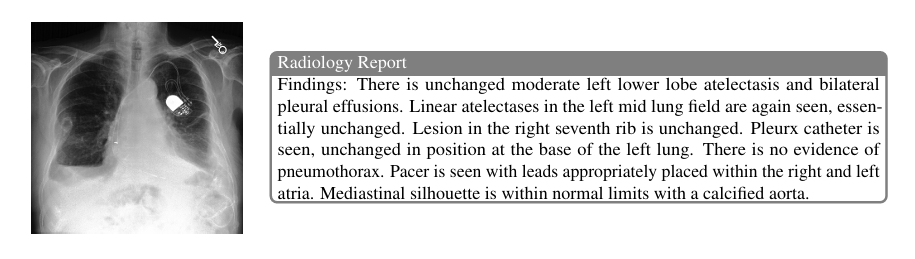
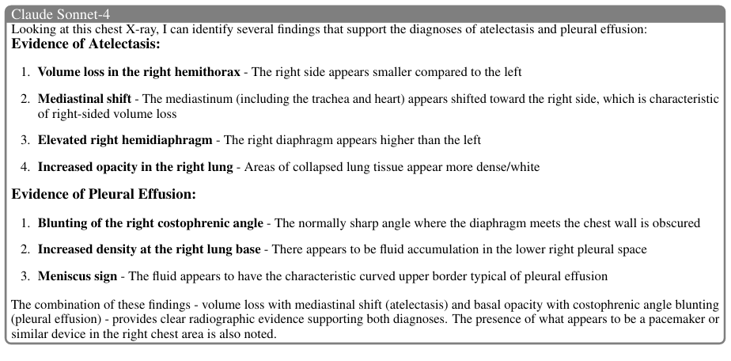
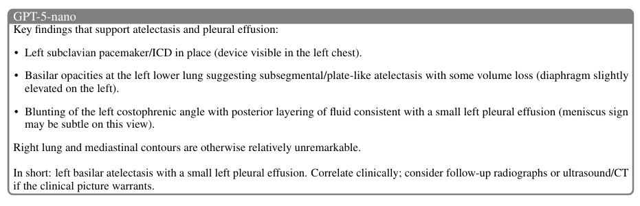
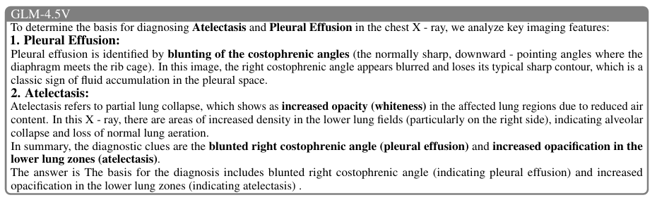
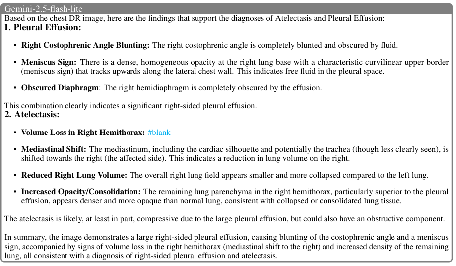
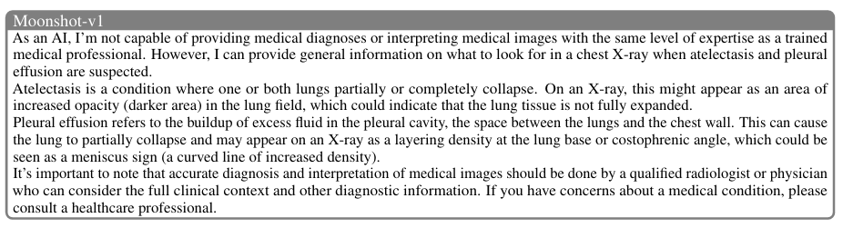
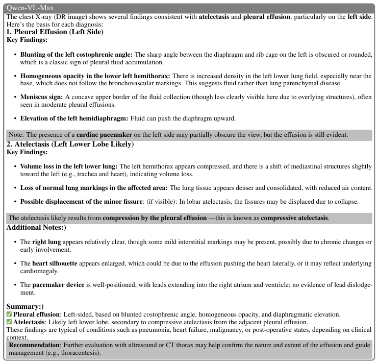
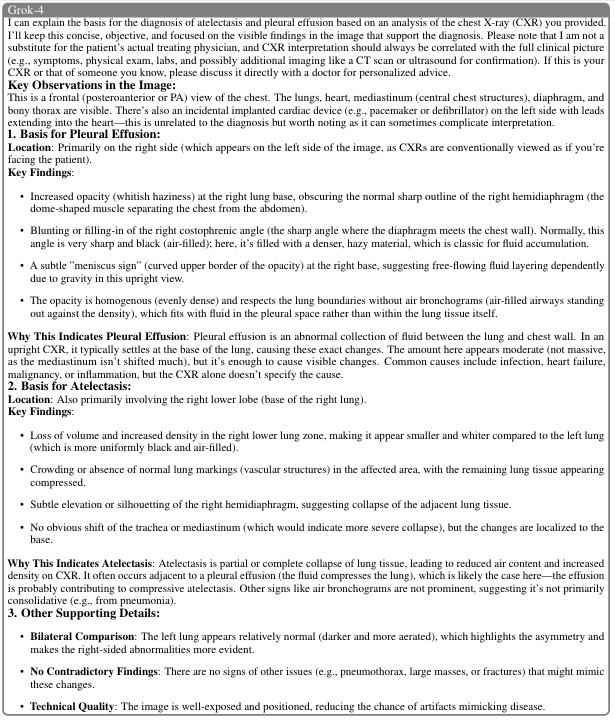

<div align="center">
<h1>Turning Drift into Constraint: Robust Reasoning Alignment in Non-Stationary Environments</h1>

[**Xiaoyu Yang**](https://xiaoyuyoung.github.io/)<sup>1</sup>&emsp;
[**Jie Lu**](https://profiles.uts.edu.au/Jie.Lu)<sup>1</sup>&emsp;
**Wei Duan**<sup>1</sup>&emsp;
**En Yu**<sup>1</sup>&emsp;

<sup>1</sup>University of Technology Sydney, Sydney, Australia

**ICML 2025**

<a href='https://xiaoyuyoung.github.io/APO/'></a>

<a href="https://arxiv.org/abs/2510.04142"></a>
<a href="https://openreview.net/forum?id=jgebUtw1lA"></a>
<a href='https://huggingface.co/datasets/MiaoMiaoYang/CXR-MAX/'></a>
<!-- <a href='https://xiaoyuyoung.github.io/CPO/'></a> -->
</div>


This repository is a PyTorch implementation of Autonomous Preference Optimization proposed in *Turning Drift into Constraint: Robust Reasoning Alignment in Non-Stationary Environments* (ICML 2025)

This paper identifies a critical yet underexplored challenge in reasoning alignment from multiple multi-modal large language models (MLLMs): In non-stationary environments, the diverse reasoning distributions of source models often evolve unpredictably, transmitting systematic biases and drift to the target model. To address this, we formulate multi-source reasoning alignment as a constraint satisfaction problem under concept drift theory. We propose Autonomous Preference Optimization (APO), a novel framework that treats inter-model divergences not as noise, but as dynamic negative constraints. APO operates via a two-stage protocol: first, supervised bootstrapping projects the target model into the capability union of source models; second, constraint-aware optimization synthesizes a consistent consensus manifold by explicitly suppressing drifting trajectories via a multi-negative plackett-luce objective. Extensive experiments on chest X-ray interpretation demonstrate that our 7B model achieves superior robustness, outperforming even proprietary source models in average accuracy. Furthermore, we release CXR-MAX, a large-scale benchmark comprising 170,982 reasoning trajectories from seven large-scale MLLMs to facilitate research on reasoning alignment under drift.


The code in this repo is copied/modified from [Qwen2.5-VL](https://github.com/QwenLM/Qwen2.5-VL).


The main contributions of our methods:

- We establish a novel framework that recasts multi-source reasoning integration as a constraint satisfaction problem in non-stationary environments. Within the perspective of concept drift theory, we demonstrate how conflicting reasoning trajectories can be transformed from disruptive noise into actionable negative constraints for decision boundary sharpening. 

- We propose Autonomous Preference Optimization (APO), a self-supervised alignment strategy that eliminates the need for ground-truth labels. By treating the consensus among source models as positive signals and their drifting conflicts as negative constraints, APO autonomously constructs preference pairs to guide robust reasoning alignment. 
    
- We conduct extensive evaluations across diverse benchmarks. Our results demonstrate that APO achieves superior robustness and generalization while utilizing only 10\% of the data typically required by standard alignment methods, effectively mitigating drifts inherent in individual source models. 
    
- To facilitate future research on alignment under drift, we release CXR-MAX, a large-scale benchmark comprising over 170k reasoning trajectories with fine-grained alignment annotations. This serves as a critical testbed for studying inter-model dynamics and reasoning consistency in high-stakes domains. 

-----------------------------------------------

## Training

The supervised-fining (SFT) and reinforced fine-tuning (RFT) are supported by [ms-swift](https://github.com/modelscope/ms-swift)

To supervised-fine the Qwen2.5-VL with multi-node distributed training, run the following with 2 GPUs:

```bash
nohup bash SFT-Qwen2.5.sh > sft.log 2>&1 &
```

To reinforced fine-tune the Qwen2.5-VL with multi-node distributed training, run the following with 2 GPUs:


```bash
nohup bash APO-Qwen2.5.sh > cpo.log 2>&1 &
```


## CXR-MAX (**M**ulti-source **A**lignment for **X**-rays) Dataset

To evaluate reasoning alignment in non-stationary environments, a dataset exhibiting high-variance inter-model drift is essential. However, existing benchmarks typically rely on single-source annotations or static consensus, failing to capture the dynamic conflicts inherent in multi-stream reasoning.
Addressing this gap, we introduce \textbf{CXR-MAX} (\textbf{M}ulti-source \textbf{A}lignment for \textbf{X}-rays), a large-scale benchmark designed to facilitate the study of autonomous preference optimization in high-stakes domains.

CXR-MAX extends the [MIMIC-CXR](https://physionet.org/content/mimic-cxr/2.1.0/) by aggregating reasoning trajectories from seven distinct, publicly available MLLMs. CXR-MAX provides 170,982 distillation instances of reasoning trajectories covering 14 thoracic pathologies, establishing a large-scale benchmark for reasoning alignment with multiple reasoning trajectories from various MLLMs in clinical chest X-ray interpretation. 

We have upload this dataset on [huggingface](https://huggingface.co/datasets/MiaoMiaoYang/CXR-MAX), you can download using this command:

```
git clone https://huggingface.co/datasets/MiaoMiaoYang/CXR-MAX
```








