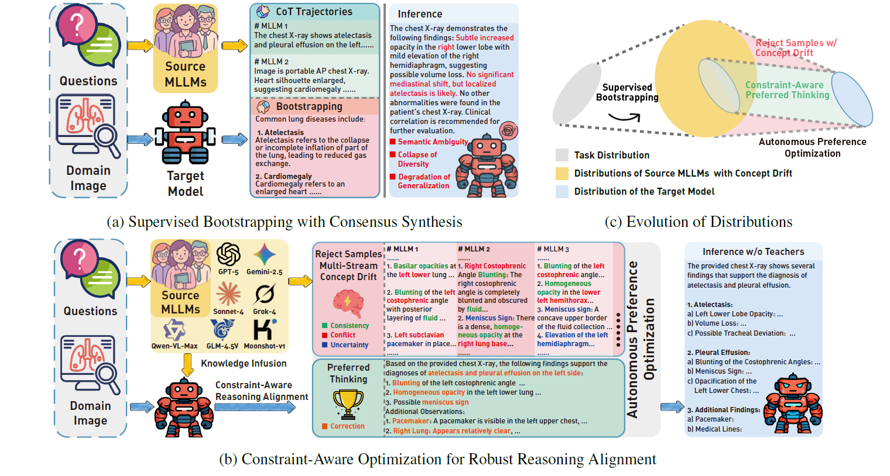
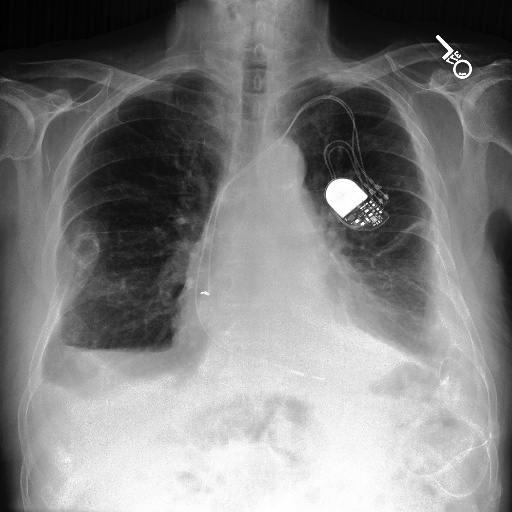

<div align="center">
<h1>Turning Drift into Constraint: Robust Reasoning Alignment in Non-Stationary Environments</h1>

[**Xiaoyu Yang**](https://xiaoyuyoung.github.io/)<sup>1</sup>&emsp;
**En Yu**<sup>1</sup>&emsp;
**Wei Duan**<sup>1</sup>&emsp;
[**Jie Lu**](https://profiles.uts.edu.au/Jie.Lu)<sup>1</sup>&emsp;

<sup>1</sup>University of Technology Sydney, Sydney, Australia

**ICML 2025**

<a href='https://xiaoyuyoung.github.io/APO/'></a>

<a href="https://arxiv.org/abs/2510.04142"></a>
<a href="https://openreview.net/forum?id=jgebUtw1lA"></a>
<a href='https://huggingface.co/datasets/MiaoMiaoYang/CXR-MAX/'></a>
<!-- <a href='https://xiaoyuyoung.github.io/APO/'></a> -->
</div>


This repository is a PyTorch implementation of Autonomous Preference Optimization proposed in *Turning Drift into Constraint: Robust Reasoning Alignment in Non-Stationary Environments* (ICML 2025)

This paper identifies a critical yet underexplored challenge in reasoning alignment from multiple multi-modal large language models (MLLMs): In non-stationary environments, the diverse reasoning distributions of source models often evolve unpredictably, transmitting systematic biases and drift to the target model. To address this, we formulate multi-source reasoning alignment as a constraint satisfaction problem under concept drift theory. We propose Autonomous Preference Optimization (APO), a novel framework that treats inter-model divergences not as noise, but as dynamic negative constraints. APO operates via a two-stage protocol: first, supervised bootstrapping projects the target model into the capability union of source models; second, constraint-aware optimization synthesizes a consistent consensus manifold by explicitly suppressing drifting trajectories via a multi-negative plackett-luce objective. Extensive experiments on chest X-ray interpretation demonstrate that our 7B model achieves superior robustness, outperforming even proprietary source models in average accuracy. Furthermore, we release CXR-MAX, a large-scale benchmark comprising 170,982 reasoning trajectories from seven large-scale MLLMs to facilitate research on reasoning alignment under drift.


The code in this repo is copied/modified from [Qwen2.5-VL](https://github.com/QwenLM/Qwen2.5-VL).



The main contributions of our methods:

- We establish a novel framework that recasts multi-source reasoning integration as a constraint satisfaction problem in non-stationary environments. Within the perspective of concept drift theory, we demonstrate how conflicting reasoning trajectories can be transformed from disruptive noise into actionable negative constraints for decision boundary sharpening. 

- We propose Autonomous Preference Optimization (APO), a self-supervised alignment strategy that eliminates the need for ground-truth labels. By treating the consensus among source models as positive signals and their drifting conflicts as negative constraints, APO autonomously constructs preference pairs to guide robust reasoning alignment. 
    
- We conduct extensive evaluations across diverse benchmarks. Our results demonstrate that APO achieves superior robustness and generalization while utilizing only 10\% of the data typically required by standard alignment methods, effectively mitigating drifts inherent in individual source models. 
    
- To facilitate future research on alignment under drift, we release CXR-MAX, a large-scale benchmark comprising over 170k reasoning trajectories with fine-grained alignment annotations. This serves as a critical testbed for studying inter-model dynamics and reasoning consistency in high-stakes domains. 

-----------------------------------------------

## Training

The supervised-fining (SFT) and reinforced fine-tuning (RFT) are supported by [ms-swift](https://github.com/modelscope/ms-swift)

To supervised-fine the Qwen2.5-VL with multi-node distributed training, run the following with 2 GPUs:

```bash
nohup bash SFT-Qwen2.5.sh > sft.log 2>&1 &
```

To reinforced fine-tune the Qwen2.5-VL with multi-node distributed training, run the following with 2 GPUs:


```bash
nohup bash APO-Qwen2.5.sh > cpo.log 2>&1 &
```


## CXR-MAX (**M**ulti-source **A**lignment for **X**-rays) Dataset

To evaluate reasoning alignment in non-stationary environments, a dataset exhibiting high-variance inter-model drift is essential. However, existing benchmarks typically rely on single-source annotations or static consensus, failing to capture the dynamic conflicts inherent in multi-stream reasoning.
Addressing this gap, we introduce \textbf{CXR-MAX} (\textbf{M}ulti-source \textbf{A}lignment for \textbf{X}-rays), a large-scale benchmark designed to facilitate the study of autonomous preference optimization in high-stakes domains.

CXR-MAX extends the [MIMIC-CXR](https://physionet.org/content/mimic-cxr/2.1.0/) by aggregating reasoning trajectories from seven distinct, publicly available MLLMs. CXR-MAX provides 170,982 distillation instances of reasoning trajectories covering 14 thoracic pathologies, establishing a large-scale benchmark for reasoning alignment with multiple reasoning trajectories from various MLLMs in clinical chest X-ray interpretation. 

We have upload this dataset on [huggingface](https://huggingface.co/datasets/MiaoMiaoYang/CXR-MAX), you can download using this command:

```
git clone https://huggingface.co/datasets/MiaoMiaoYang/CXR-MAX
```

<p align="center">
  
</p>

### 🏥 Radiology Report (Ground Truth)
**Findings:** There is unchanged moderate left lower lobe atelectasis and bilateral pleural effusions. Linear atelectases in the left mid lung field are again seen, essentially unchanged. Lesion in the right seventh rib is unchanged. Pleurx catheter is seen, unchanged in position at the base of the left lung. There is no evidence of pneumothorax. Pacer is seen with leads appropriately placed within the right and left atria. Mediastinal silhouette is within normal limits with a calcified aorta.

---


*Click on each model to view their divergent reasoning trajectories based on the same X-Ray image.*

<details>
<summary><b>1. Claude Sonnet-4</b></summary>
<br>

Looking at this chest X-ray, I can identify several findings that support the diagnoses of atelectasis and pleural effusion:

**Evidence of Atelectasis:**
- **Volume loss in the right hemithorax** - The right side appears smaller compared to the left
- **Mediastinal shift** - The mediastinum appears shifted toward the right side
- **Elevated right hemidiaphragm** - The right diaphragm appears higher than the left
- **Increased opacity in the right lung** - Areas of collapsed lung tissue appear more dense/white

**Evidence of Pleural Effusion:**
- **Blunting of the right costophrenic angle** - The normally sharp angle is obscured
- **Increased density at the right lung base** - There appears to be fluid accumulation in the lower right pleural space
- **Meniscus sign** - The fluid appears to have the characteristic curved upper border

The combination of these findings provides clear radiographic evidence supporting both diagnoses...
</details>

<details>
<summary><b>2. GPT-5-nano</b></summary>
<br>

Key findings that support atelectasis and pleural effusion:
- Left subclavian pacemaker/ICD in place (device visible in the left chest).
- Basilar opacities at the left lower lung suggesting subsegmental/plate-like atelectasis with some volume loss.
- Blunting of the left costophrenic angle with posterior layering of fluid consistent with a small left pleural effusion.

Right lung and mediastinal contours are otherwise relatively unremarkable.
In short: left basilar atelectasis with a small left pleural effusion. Correlate clinically...
</details>

<details>
<summary><b>3. GLM-4.5V</b></summary>
<br>

To determine the basis for diagnosing **Atelectasis** and **Pleural Effusion** in the chest X-ray, we analyze key imaging features:

**1. Pleural Effusion:**
Pleural effusion is identified by **blunting of the costophrenic angles**... In this image, the right costophrenic angle appears blurred and loses its typical sharp contour...

**2. Atelectasis:**
Atelectasis refers to partial lung collapse, which shows as **increased opacity (whiteness)** in the affected lung regions... In this X-ray, there are areas of increased density in the lower lung fields (particularly on the right side)...

In summary, the diagnostic clues are the **blunted right costophrenic angle** and **increased opacification in the lower lung zones**.
</details>

<details>
<summary><b>4. Gemini-2.5-flash-lite</b></summary>
<br>

Based on the chest DR image, here are the findings that support the diagnoses of Atelectasis and Pleural Effusion:

**1. Pleural Effusion:**
- **Right Costophrenic Angle Blunting:** The right costophrenic angle is completely blunted and obscured by fluid.
- **Meniscus Sign:** There is a dense, homogeneous opacity at the right lung base with a characteristic curvilinear upper border...
- **Obscured Diaphragm:** The right hemidiaphragm is completely obscured by the effusion.

**2. Atelectasis:**
- **Mediastinal Shift:** The mediastinum is shifted towards the right...
- **Reduced Right Lung Volume:** The overall right lung field appears smaller and more collapsed...
- **Increased Opacity/Consolidation:** The remaining lung parenchyma in the right hemithorax appears denser...

In summary, the image demonstrates a large right-sided pleural effusion... accompanied by signs of volume loss in the right hemithorax...
</details>

<details>
<summary><b>5. Moonshot-v1</b></summary>
<br>

As an AI, I'm not capable of providing medical diagnoses or interpreting medical images with the same level of expertise as a trained medical professional. However, I can provide general information...

Atelectasis is a condition where one or both lungs partially or completely collapse. On an X-ray, this might appear as an area of increased opacity...

Pleural effusion refers to the buildup of excess fluid in the pleural cavity... This can cause the lung to partially collapse and may appear on an X-ray as a layering density at the lung base or costophrenic angle...
</details>

<details>
<summary><b>6. Qwen-VL-Max</b></summary>
<br>

The chest X-ray (DR image) shows several findings consistent with **atelectasis** and **pleural effusion**, particularly on the **left side**. Here's the basis for each diagnosis:

**1. Pleural Effusion (Left Side)**
- **Blunting of the left costophrenic angle:** The sharp angle between the diaphragm and rib cage on the left is obscured or rounded...
- **Homogeneous opacity in the lower left hemithorax:** There is increased density in the left lower lung field...
- **Meniscus sign:** A concave upper border of the fluid collection...
- **Elevation of the left hemidiaphragm:** Fluid can push the diaphragm upward.

**2. Atelectasis (Left Lower Lobe Likely)**
- **Volume loss in the left lower lung:** The left hemithorax appears compressed, and there is a shift of mediastinal structures slightly toward the left...
- **Loss of normal lung markings in the affected area:** The lung tissue appears denser and consolidated...

**Summary:**
✔ **Pleural effusion**: Left-sided, based on blunted costophrenic angle, homogeneous opacity, and diaphragmatic elevation.
✔ **Atelectasis**: Likely left lower lobe, secondary to compressive atelectasis from the adjacent pleural effusion.
</details>

<details>
<summary><b>7. Grok-4</b></summary>
<br>

I can explain the basis for the diagnosis of atelectasis and pleural effusion based on an analysis of the chest X-ray (CXR) you provided. I'll keep this concise, objective, and focused on the visible findings...

**1. Basis for Pleural Effusion:**
- Increased opacity (whitish haziness) at the right lung base, obscuring the normal sharp outline of the right hemidiaphragm...
- Blunting or filling-in of the right costophrenic angle...
- A subtle "meniscus sign" (curved upper border of the opacity) at the right base...

**2. Basis for Atelectasis:**
- Loss of volume and increased density in the right lower lung zone, making it appear smaller and whiter compared to the left lung...
- Crowding or absence of normal lung markings (vascular structures) in the affected area...
- Subtle elevation or silhouetting of the right hemidiaphragm, suggesting collapse of the adjacent lung tissue.
</details>


If you find this repository useful for your research, please consider citing our paper:

```bibtex
@inproceedings{anonymous2026turning,
    title={Turning Drift into Constraint: Robust Reasoning Alignment in Non-Stationary Multi-Stream Environments},
    author={Yang, Xiaoyu and Yu, En and Duan, Wei and Lu, Jie},
    booktitle={Forty-third International Conference on Machine Learning},
    year={2026},
    url={https://openreview.net/forum?id=jgebUtw1lA}
}
```
